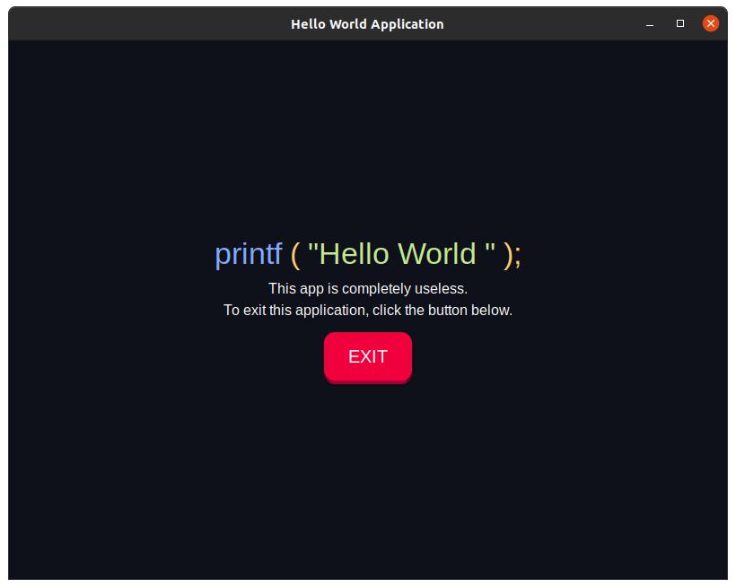

<h1 align="center">Py-HTML</h1>

  Using HTML as GUI & Python as Backend

  
Example GUI Hello World Application Made Using This Technique

  

 

`main.html`  - Contains All The GUI, That is Webpage Itself    
`main.py`  - Contains The Source Engine Code Thats Executes The Webpage Code in GUI Window and Executes all Functions

 

# Working:
This application displays main.html in this window, so when the user clicks exitButton(html), its url changes to the method name 'exit(),' and python fetches the url form the webwindow and invokes the 'exit()' function as specified in the python file.
